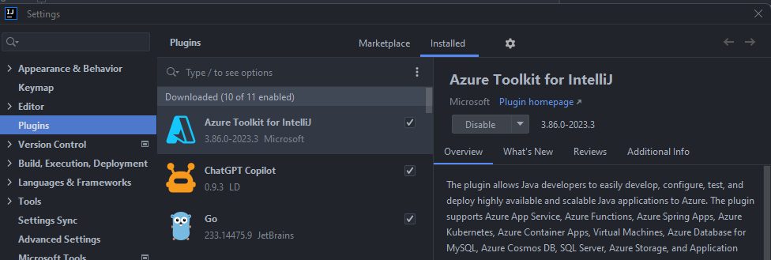
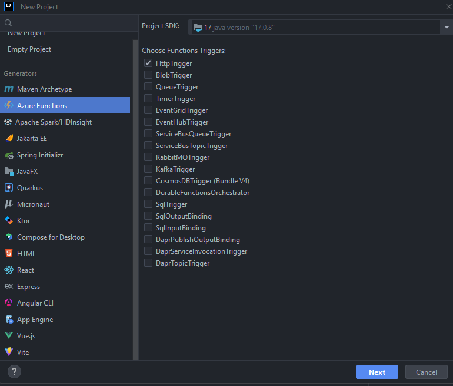
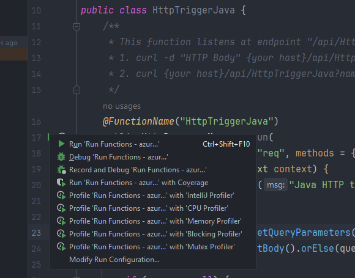
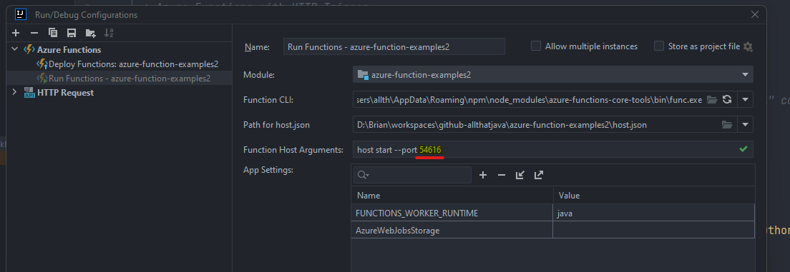
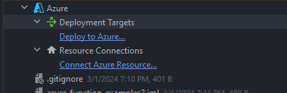
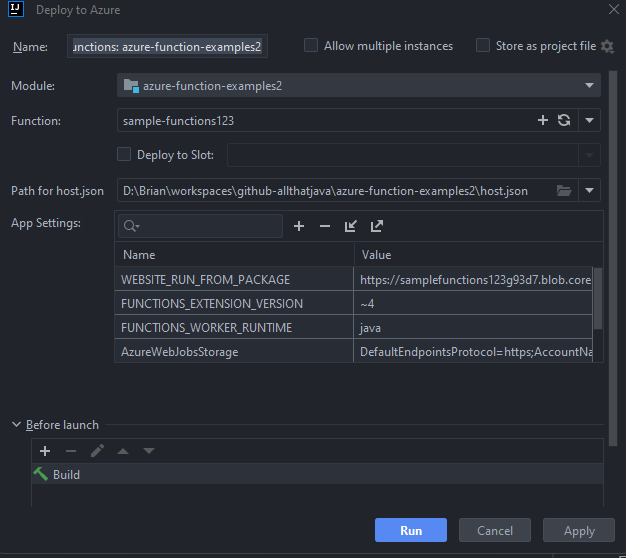
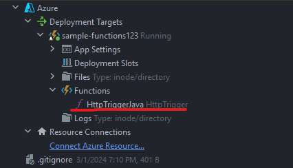
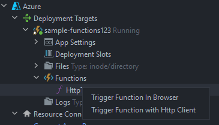
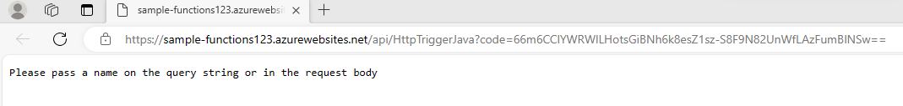
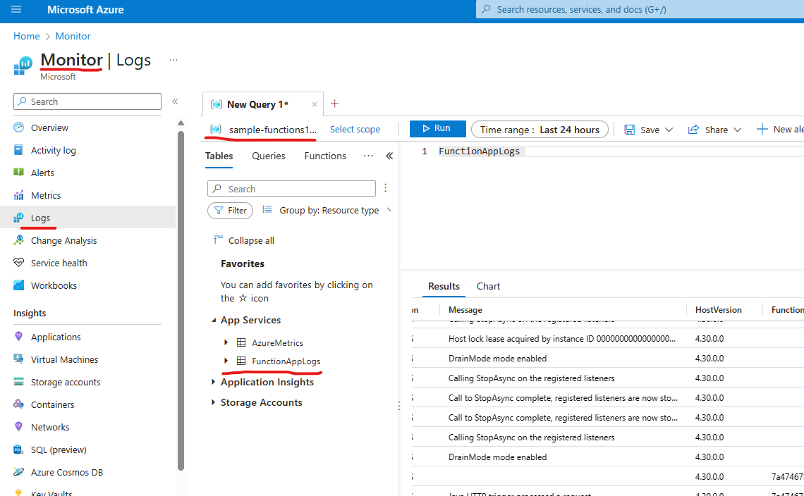

### Azure Function example
#### First install Azure Toolkit for Intellij

#### Create Azure Function project with the feature you want

#### To run the function locally
select the run button beside the method you are going to run

#### You can change port and stuff
By changing configuration on 

#### To deploy functions to Azure Cloud 
- First login to Azure Cloud account in Azure Explorer
Open up the 'Azure' on the project and click on Deploy to Azure...

#### Click on 'Run' 

- Then a few seconds later you will see the deployed functions under the Azure/Deployment Target/{your function on Azure}

#### Run the function that deployed on Cloud
Right click on the function you have deployed on Cloud then click on "Trigger Function in Browser"

#### Check the code on the browser
You can see the 'code' parameter has been added. It is from the 'App Key' menu on the Azure.
It needed to be provide for the security measure. If you run it from Intellij, it will be automatically attached.
However, if it needs to be called from other service, 'code' must be provided to call that function.

#### See the log on Azure Portal
You can see the log in the Resource Group - Logs tab. It seems like it has 4-5 min delay to show the log...
